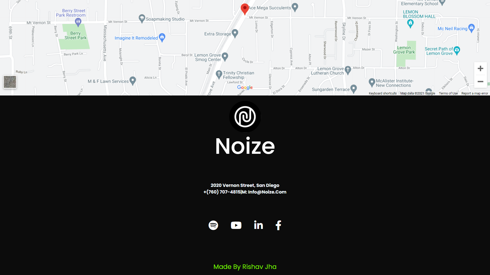

# NOIZE - A Music Website

## Website URL - [NOIZE](https://rishav-jha-mech.github.io/Noize/Noize/)

### Picture 1 -

### Picture 2 -

### Picture 3 -

### This was the final draft where i imporved the navbar removed neccessary design on social media icons. widening of "FEEL THE NOIZE" on hover,and most importantly corrected the contact portion which i corrected in minutes, because now i have greater experience on making forms, so yeah the problem got solved by using the '%' units instead to vh vw px units (used by me earlier for input boxes and buttons).
